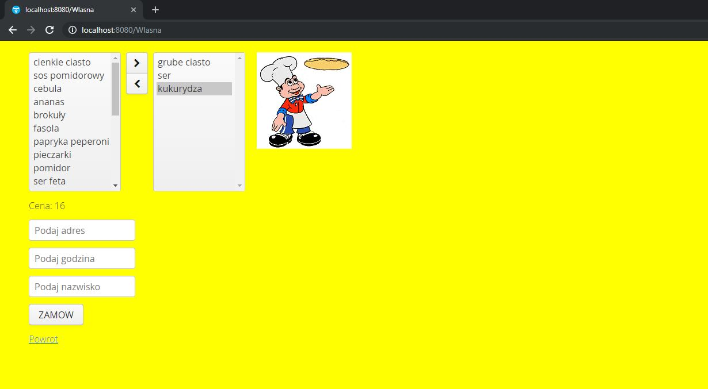
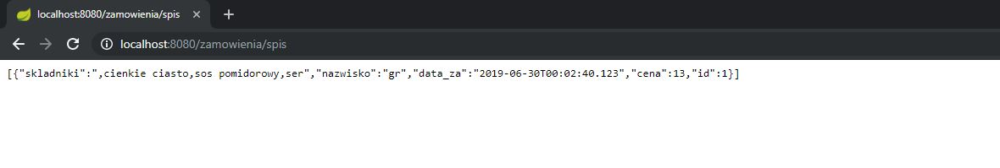

# Pizzeria
Aplikacja internetowa do zamawiania pizzy. Użyto w tym projekcjie Java, spring, hibernate, vadinn, css.

Strona Startowa:
Wybiera się pizze i po przez stream api wyliczona jest cena. Cena pizzy to suma cen składników przypadająca na pizze. Następnie należy wybrać kiedy ma być dostarczona dostawa.

Utworzony rest, w którym jest dostęp do wszystkich danych zapisanych w bazie

